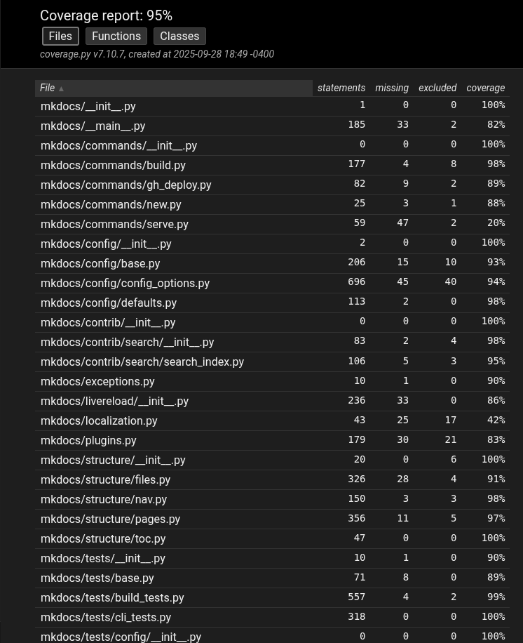
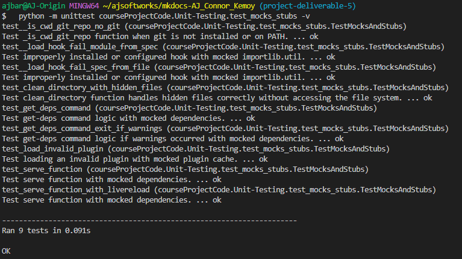

# How to Run Added Unit Tests

## Prerequisites

1.  Clone the project:

    ```bash
    git clone https://github.com/kemoycampbell/mkdocs-AJ_Connor_Kemoy
    ```

2.  Change directory into the project folder and create a virtual environment.
    In this example, create a virtual environment called mkdocVenv:

    ```bash
    cd mkdocs-AJ_Connor_Kemoy && python3 -m venv mkdocVenv
    ```

3.  Activate the mkdocVenv environment.
**The command depends on your operating system:**

    - Linux & MacOS

    ```bash
    source mkdocVenv/bin/activate
    ```

    - Windows

    ```bash
    source mkdocVenv/Scripts/activate
    ```

4.  Install Hatch (the main testing tool):

   ```bash
   pip install hatch
   ```

## Running the Edge Case Tests

To run only the newly added edge case tests in `courseProjectCode/Unit-Testing/test_edge_cases.py`:

```bash
python -m unittest courseProjectCode.Unit-Testing.test_edge_cases -v
```

### Expected Output

- **Total Tests**: 6 tests
- **Expected Results**: 6 passed, 0 failed
- **Runtime**: ~0.004 seconds

### Sample Output

```bash
test_build_datetime_with_source_date_epoch ... ok
test_build_datetime_without_source_date_epoch ... ok
test_build_timestamp_with_empty_pages ... ok
test_config_option_immutable_default ... ok
test_config_option_mutable_default_copy ... ok
test_config_option_set_on_non_config_object ... ok

----------------------------------------------------------------------
Ran 6 tests in 0.004s

OK
```

## Running All Unit Tests

To run the complete test suite including the newly added tests:

```bash
hatch run test:test
```

### Expected Output

- **Total Tests**: 731 tests per Python version (baseline was 725)
- **Typical Results**: 725-727 passed, 4-6 skipped per version
- **Runtime**: ~10-18 seconds per Python version

## Reproducing Coverage Report

To generate a coverage report that includes the newly added tests:

```bash
python -m coverage run --source=mkdocs -m unittest discover -s mkdocs/tests -p "*_tests.py"
python -m coverage report
```

### Expected Coverage Metrics

- **Overall Coverage**: 95% (baseline was 90.31%)
- **Coverage Improvement**: +4.69%
- **Additional Tests**: 6 new edge case tests



To generate an HTML coverage report:

```bash
python -m coverage html
```

The HTML report will be generated in the `htmlcov/` directory.

## Notes

- The new tests target edge cases in `mkdocs/config/base.py` and `mkdocs/utils/__init__.py`
- Tests focus on mutable/immutable default handling, SOURCE_DATE_EPOCH environment variable, and error handling
- All tests use the unittest framework to maintain consistency with the existing MkDocs test suite

---

## Running the Mocking & Stubbing Tests

To run only the newly added mocking and stubbing tests in `courseProjectCode/Unit-Testing/test_mocks_stubs.py`:

**Important**: Ensure all project dependencies are installed before running these tests:

```bash
pip install -e .
```

Then run the mocking tests:

```bash
python -m unittest courseProjectCode.Unit-Testing.test_mocks_stubs -v
```

### Expected Output

- **Total Tests**: 9 tests
- **Expected Results**: 9 passed, 0 failed
- **Runtime**: ~0.1-0.2 seconds

### Sample Output

```bash
test__is_cwd_git_repo_no_git ... ok
test__load_hook_fail_module_from_spec ... ok
test__load_hook_fail_spec_from_file ... ok
test_clean_directory_with_hidden_files ... ok
test_get_deps_command ... ok
test_get_deps_command_exit_if_warnings ... ok
test_load_invalid_plugin ... ok
test_serve_function ... ok
test_serve_function_with_livereload ... ok

----------------------------------------------------------------------
Ran 9 tests in 0.123s

OK
```



### Coverage Improvements from Mocking Tests

The mocking and stubbing tests improved coverage in the following modules:

- **mkdocs/utils/**init**.py**: 88% → 91%
- **mkdocs/**main**.py**: 82% → 89%
- **mkdocs/config/config_options.py**: 93% → 94%
- **mkdocs/command/gh_deploy.py**: 89% → 94%
- **mkdocs/commands/serve.py**: 20% → 83%
- **Overall Coverage**: 91% → 93%

### Notes on Mocking Tests

- Tests use `unittest.mock` to isolate components and avoid external dependencies
- Focus areas: CLI commands, error handling, file system operations, plugin loading, and server functionality
- All tests prevent actual file system modifications, network operations, or subprocess execution
