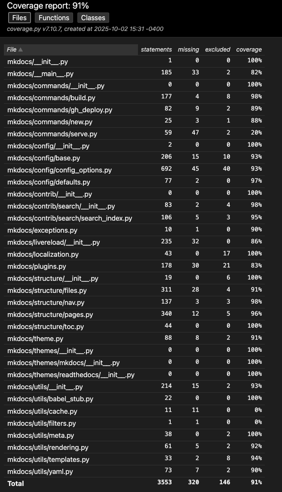
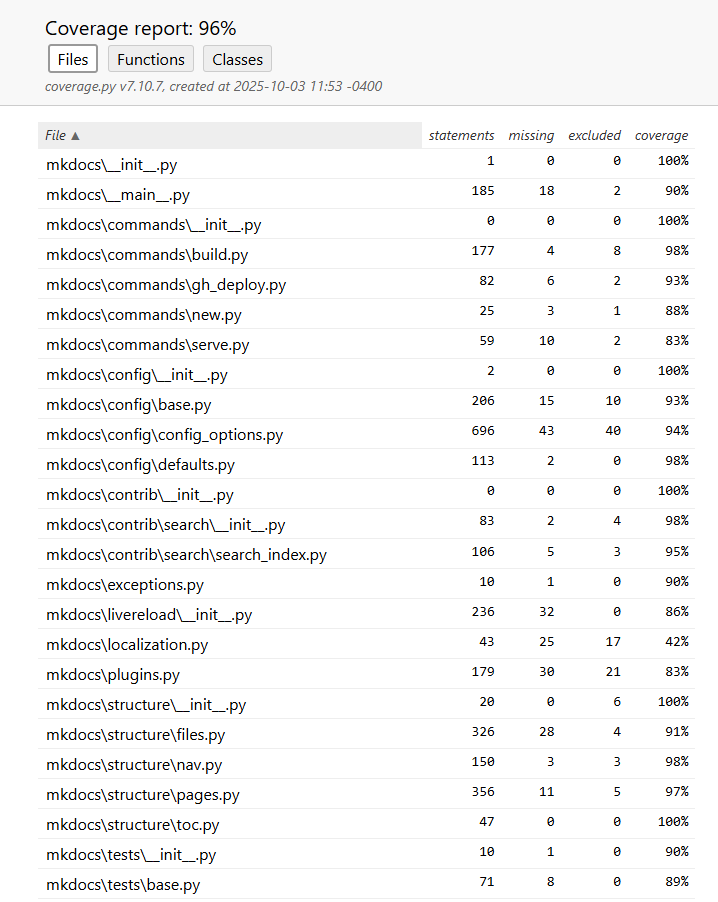

# Unit Testing II (Mocking & Stubbing)

## Overview
This document focuses on improving existing tests and test coverage by mocking/stubbing certain dependencies. The current mkdocs tests exhibit extensive use of mocks and stubs. This document outlines the rationale behind the mocking strategy, identifies areas of focus for new test cases, and provides a structured approach to implementing these tests.

get-deps command
increases coverage of existing tests by mocking out get_deps dependency
Coverage of __main__.py increased from 82% to 89%

clean_directory()
    Mocking the os file system 
    extends branch coverage of existing tests and does it without touching the real file system

_load_hook()
    Mocking the importlib module
    extends branch coverage of existing tests and does it without touching the real file/import system

## Coverage Gaps
The coverage report indicated several areas where coverage could be improved. Specifically, the following files and functions were identified as having gaps:
- `mkdocs/utils/__init__.py`: Missing testing that `clean_directory` ignores hidden files and directories
    - **Initial coverage:** 88%
- `mkdocs/__main__.py`: Missing testing of `get-deps` command (from cli)
    - **Initial coverage:** 82%
- `mkdocs/config/config_options.py`: Missing testing of two functions
    - `Hook._load_hook` has some untested error raising logic for when a spec or module can't be found, and interacts with the `importlib` module
    - `Plugins.load_plugin` has some error raising logic for when an installed plugin doesn't properly subclass `BasePlugin`
    - **Initial coverage:** 93%
- `mkdocs/command/gh_deploy.py`: Missing testing of error handling in `_is_cwd_git_repo_no_git` when the git command cannot be found
    - **Initial coverage:** 89%
- `mkdocs/commands/serve.py`: Missing testing of `serve` command
    - Current tests mock this method when testing the `mkdocs serve` cli command
    - **Initial coverage:** 20%

The image below shows the coverage report before adding the new tests.


## New Test Cases
**Rationales & Areas of Focus**  
Based on the coverage report, we identified several areas where code coverage could be improved. Specifically, there were a few components that either lacked testing of certain error conditions or had complex dependencies that made testing challenging without mocking. The following test cases are designed to address these gaps.

### Test File: `courseProjectCode/test_mocks_stubs.py`

#### 1. `clean_directory` ignores hidden files

**Target**: `mkdocs/utils/__init__.py` lines 142-143
```python
def test_clean_directory_with_hidden_files(self):
    """Test clean_directory function handles hidden files correctly without accessing the file system."""
```
**Mocking Strategy:**

The `os` and `shutil` modules were mocked to simulate a directory containing hidden files and directories and simulate the removal of non-hidden simulated files. This allows us to test the behavior of `clean_directory` without actually modifying the file system. This improves the branch coverage of the function by ensuring that the hidden file logic is executed all without touching the real file system.

#### 2. `get-deps` command, no warnings

**Target**: `mkdocs/__main__.py` lines 338-356
```python
def test_get_deps_command(self):
    """Test get-deps command logic with mocked dependencies."""
```
**Mocking Strategy:**

The `mkdocs_get_deps` module's `get_deps` function was mocked since it is an external dependency (installed via `pip`) that interacts with a config `yml` file to determine what packages may need to be installed. Mocking this allows us to test the `get-deps` command line command in isolation, ensuring that it behaves correctly under normal conditions without installing any other packages.

#### 3. `get-deps` command, with warnings

**Target**: `mkdocs/__main__.py` lines 338-356
```python
def test_get_deps_command_exit_if_warnings(self):
    """Test get-deps command logic if warnings occurred with mocked dependencies."""
```
**Mocking Strategy:**

The `mkdocs_get_deps` module's `get_deps` function was mocked since it is an external dependency (installed via `pip`) that interacts with a config `yml` file to determine what packages may need to be installed. `logging.getLogger` and `mkdocs.utils.CountHandler` are also mocked to prevent any logging during the test (*attempting to use the logger during testing raises an error*) and to inject a warning into the code, simulating a warning occuring while the `get-deps` command is running.

#### 4. `_load_hook` raises `ValidationError` when `importlib.util.spec_from_file_location` returns `None`
    
**Target**: `mkdocs/config/config_options.py` lines 1195-1196
```python
def test__load_hook_fail_spec_from_file(self):
    """Test improperly installed or configured hook with mocked importlib.util."""
```
**Mocking Strategy:**

The `importlib.util` module was mocked to simulate the behavior of `spec_from_file_location` returning `None`, allowing us to test the error handling logic in `_load_hook` without relying on the actual import system/file system.

#### 5. `_load_hook` raises `ValidationError` when `importlib.util.module_from_spec` returns `None`

**Target**: `mkdocs/config/config_options.py` lines 1199-1200
```python
def test__load_hook_fail_module_from_spec(self):
    """Test improperly installed or configured hook with mocked importlib.util."""
```
**Mocking Strategy:**

The `importlib.util` module was mocked to simulate the behavior of `spec_from_file_location` returning `None`, allowing us to test the error handling logic in `_load_hook` without relying on the actual import system/file system.

#### 6. `Plugins.load_plugin` raises `ValidationError` when plugin does not subclass `BasePlugin`

**Target**: `mkdocs/config/config_options.py` lines 1123-1127
```python
def test_load_invalid_plugin(self):
    """Test loading an invalid plugin with mocked plugin cache."""
```
**Mocking Strategy:**

The `Plugins._plugin_cache` was mocked to simulate the presence of a plugin that does not subclass `BasePlugin`. This allows us to test the error handling logic in `Plugins.load_plugin` without relying on actual installed plugins.

#### 7. `_is_cwd_git_repo_no_git` raises `Abort` when git command is not found

**Target**: `mkdocs/command/gh_deploy.py` lines 23-32
```python
def test__is_cwd_git_repo_no_git(self):
    """Test _is_cwd_git_repo function when git is not installed or on PATH."""
```
**Mocking Strategy:**

The `subprocess.Popen` method was mocked to raise a `FileNotFoundError`, simulating the scenario where the `git` command is not found on the system. This allows us to test the error handling logic in `_is_cwd_git_repo_no_git` without relying on the actual presence or lack thereof of the `git` command. The `logging` module's `error` method was also mocked to prevent any logging during the test since attempting to use the logger during testing raises an error.


#### 8. `serve` function runs without live reloading

**Target**: `mkdocs/commands/serve.py` lines 20-110
```python
def test_serve_function(self, mock_load_config, mock_build):
    """Test serve function with mocked dependencies."""
```
**Mocking Strategy:**
The `load_config` method from `mkdocs.config`, `build` method from `mkdocs.commands.build`, `tempfile.mkdtemp`, `os.path.isdir`, and `shutil.rmtree` were mocked to isolate the `serve` function and prevent it from performing actual file system operations or building the site. This allows us to test the `serve` function's logic without relying on external dependencies. Additionally, the `mkdocs.livereload.LiveReloadServer` class was mocked to prevent starting an actual server during the test. Also, the `info` method from the `logging` module was mocked to prevent any logging during the test since attempting to use the logger during testing raises an error. 


#### 8. `serve` function runs without live reloading

**Target**: `mkdocs/commands/serve.py` lines 85-99
```python
def test_serve_function_with_livereload(self, mock_load_config, mock_build):
    """Test serve function with mocked dependencies."""
```
**Mocking Strategy:**
The `load_config` method from `mkdocs.config`, `build` method from `mkdocs.commands.build`, `tempfile.mkdtemp`, `os.path.isdir`, and `shutil.rmtree` were mocked to isolate the `serve` function and prevent it from performing actual file system operations or building the site. This allows us to test the `serve` function's logic without relying on external dependencies. Additionally, the `mkdocs.livereload.LiveReloadServer` class was mocked to prevent starting an actual server during the test. Also, the `info` method from the `logging` module was mocked to prevent any logging during the test since attempting to use the logger during testing raises an error. 

## Running new tests
```bash
python -m unittest courseProjectCode.Unit-Testing.test_mocks_stubs -v
```

## Coverage Improvements
The new test cases have improved the overall code coverage of the mkdocs project. Specifically, the following improvements were observed:
- Overall code coverage increased from 91% to 93%
- The code coverage of `mkdocs/utils/__init__.py` increased from 88% to 91%
- The code coverage of `mkdocs/__main__.py` increased from 82% to 89%
- The code coverage of `mkdocs/config/config_options.py` increased from 93% to 94%
- The code coverage of `mkdocs/command/gh_deploy.py` increased from 89% to 94%
- The code coverage of `mkdocs/commands/serve.py` increased from 20% to 83%


The picture below shows the coverage report after adding the new tests.


## Running All Unit Tests
### Without Coverage
```bash
hatch run test:test
```
### With Coverage
This command will generate an xml coverage report called `coverage.xml` in the root directory.
```bash
hatch run test:with-coverage
```
---
*Note: If you want to view the html coverage report instead, you can either:*
1. Modify the `pyproject.toml` file to change the coverage report type from `xml` to `html` as shown below and then run the above command again:
```toml
[tool.hatch.envs.test.scripts]
test = 'python -m unittest discover -s mkdocs -p "*tests.py"'
_coverage = [
    'coverage run --source=mkdocs --omit "mkdocs/tests/*" -m unittest discover -s mkdocs -p "*tests.py"',
    "coverage html", <----- change xml to html
    "coverage report --show-missing"
]
```
OR

2. Run the following command:
```bash
python -m coverage run --source=mkdocs -m unittest discover -s mkdocs -p "*tests.py" && python -m coverage html
```
