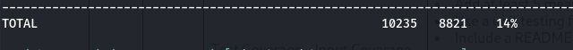
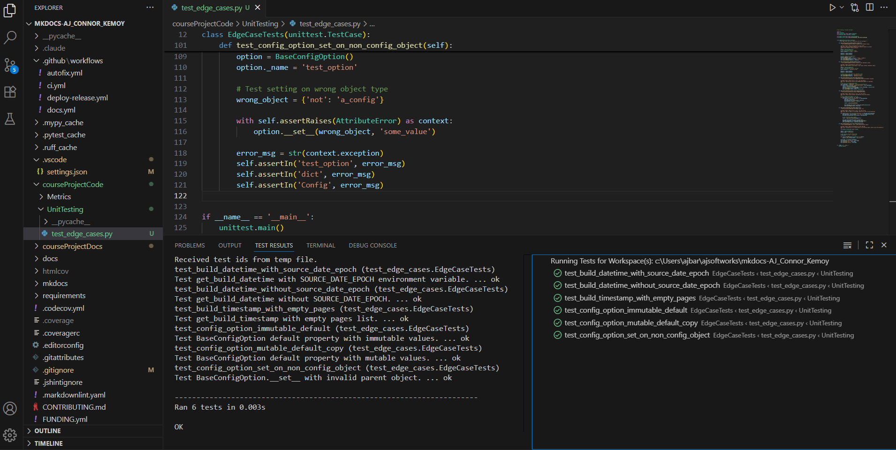
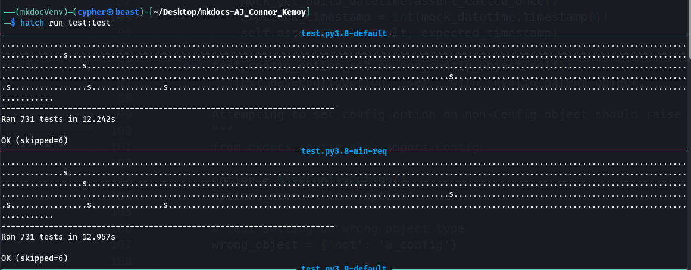

# Unit Testing I (Extend Coverage)

## Overview

This document focuses on extending MkDocs test coverage by adding unit tests for uncovered or edge-case logic. The goal is to improve code coverage and identify potential bugs in boundary conditions.

Since MkDocs is already using the unittest framework, we will continue using it rather than introducing a different testing framework.

## Baseline Analysis

### Initial Coverage Assessment

**Baseline Coverage**:
The initial test analysis shows that configuration coverage is only 14% from the initial run of configuration tests.



**Coverage Gaps**:

- `mkdocs/config/base.py`: Missing coverage on error handling
- `mkdocs/utils/__init__.py`: Missing coverage on build timestamp logic
- Edge cases in configuration option handling
- Error conditions in YAML processing
- Environment variable handling for reproducible builds

**Finding the gaps using python coverage**
```bash
python -m coverage run --source=mkdocs -m unittest mkdocs.tests.config.config_tests
python -m coverage report --show-missing
```

## New Test Cases  
**Rationales & Areas of Focus**  
The following test cases are designed to close the aforementioned [coverage gaps](#initial-coverage-assessment).  
The tests validate configuration option handling and build reproducibility to ensure robustness and correctness in edge cases that could otherwise lead to silent failures or inconsistent behavior.  

We target the following functionalities:  
- Mutable vs. Immutable Defaults  
- Reproducible Defaults – validate `SOURCE_DATE_EPOCH` environment variable for deterministic builds  
- Error Handling in Config Option Assignment – raise clear errors when misused

### Test File: `courseProjectCode/test_edge_cases.py`

#### 1. Config Option Mutable Default Copy Test

**Target**: `mkdocs/config/base.py` lines 44-48
**Purpose**: Make sure mutable default values are copied to prevent shared state between config instances.

```python
def test_config_option_mutable_default_copy(self):
    """Test BaseConfigOption default property with mutable values."""
```

**Edge Case**: When config options have mutable defaults (lists, dicts), each access should return a fresh copy to prevent accidental modification of the default value affecting other instances.

#### 2. Config Option Immutable Default Test

**Target**: `mkdocs/config/base.py` lines 47-48
**Purpose**: Make sure there is correct handling when default values don't have a copy() method.

```python
def test_config_option_immutable_default(self):
    """Test BaseConfigOption default property with immutable values."""
```

**Edge Case**: Immutable types (strings, numbers) should be returned without attempting to call copy().

#### 3. Build DateTime with SOURCE_DATE_EPOCH Test

**Target**: `mkdocs/utils/__init__.py` lines 69-73
**Purpose**: Tests reproducible build functionality using SOURCE_DATE_EPOCH environment variable.

```python
def test_build_datetime_with_source_date_epoch(self):
    """Test get_build_datetime with SOURCE_DATE_EPOCH environment variable."""
```

**Edge Case**: When SOURCE_DATE_EPOCH is set, build timestamp should use the specified time instead of current time for reproducible builds.

#### 4. Build DateTime without SOURCE_DATE_EPOCH Test

**Target**: `mkdocs/utils/__init__.py` lines 70-71
**Purpose**: Tests normal build datetime behavior when environment variable is not set.

```python
def test_build_datetime_without_source_date_epoch(self):
    """Test get_build_datetime without SOURCE_DATE_EPOCH."""
```

**Edge Case**: Normal operation should use current system time when reproducible build environment is not configured.

#### 5. Build Timestamp with Empty Pages Test

**Target**: `mkdocs/utils/__init__.py` lines 57-58
**Purpose**: Tests fallback behavior when no pages are provided for timestamp calculation.

```python
def test_build_timestamp_with_empty_pages(self):
    """Test get_build_timestamp with empty pages list."""
```

**Edge Case**: When pages collection is empty/None, function should fall back to build datetime instead of attempting to process page dates.

#### 6. Config Option Set on Non-Config Object Test

**Target**: `mkdocs/config/base.py` lines 102-105
**Purpose**: Tests error handling when attempting to set config option on wrong object type.

```python
def test_config_option_set_on_non_config_object(self):
    """Test BaseConfigOption.__set__ with invalid parent object."""
```

**Edge Case**: Attempting to use config options on non-Config objects should raise clear AttributeError with helpful message.

### Running the new test
```bash
python -m unittest courseProjectCode.Unit-Testing.test_edge_cases -v
```

### Test Output

```bash
test_build_datetime_with_source_date_epoch ... ok
test_build_datetime_without_source_date_epoch ... ok
test_build_timestamp_with_empty_pages ... ok
test_config_option_immutable_default ... ok
test_config_option_mutable_default_copy ... ok
test_config_option_set_on_non_config_object ... ok

----------------------------------------------------------------------
Ran 6 tests in 0.004s

OK
```



## Impact

Added 6 unit tests targeting edge cases in:

- **config/base.py**: Mutable/immutable default handling, config object validation
- **utils/**init**.py**: Build timestamp logic, SOURCE_DATE_EPOCH environment variable handling

These tests provide branch coverage for previously untested code paths, focusing on error handling and boundary conditions that improve software robustness.

## Compare New Test vs Additional Tests
After the new test cases were added, we obtained a total of 731 tests compared to the previously reported [725](../setup.md#sample-output).  


In addition, the previous baseline reported total code coverage as [90.31%](../setup.md#total-coverages). We now achieve 95% coverage.  


## Running the new tests
### unit tests
```bash
hatch run test:test
```

### Coverage report
```bash
python -m coverage run --source=mkdocs -m unittest discover -s mkdocs/tests -p "*_tests.py" && python -m coverage html
```


