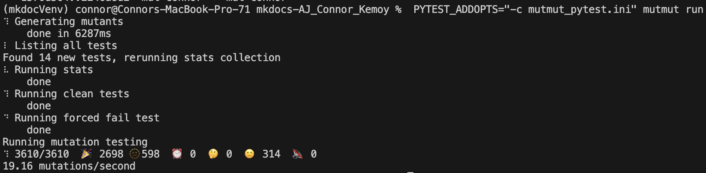
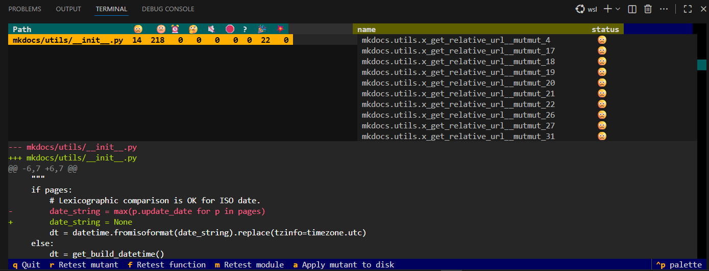
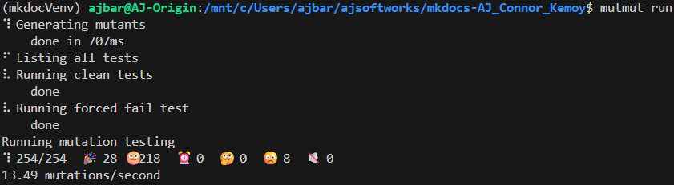

# Mutation Testing Report

This document reports on mutation testing performed on the MkDocs project using mutmut.

## Overview

**Target Module:** `mkdocs/utils/__init__.py`  
**Tool:** mutmut v3.3.1  
**Test Framework:** unittest  

> **Setup Instructions:** For detailed setup and execution instructions, see [`mutation-testing/README.md`](../courseProjectCode/mutation-testing/README.md)

---

## 📊 Mutation Testing Results

### Before: Initial Test Suite

**Baseline Run:**



```bash
Total Mutants: 3610
Killed 🎉: 2706 (74.9%)
No tests 🫥: 694 (19.2%)
Survived 🙁: 210 (5.8%)
Timeout ⏰: 0 (0%)
Suspicious 🤔: 0 (0%)
Mutation Score (tested code): 92.7% (2706 of 2916 tested mutants)
Speed: 20.03 mutations/second
```

**Analysis:** Only 2,916 mutants had test coverage (3610 - 694 = 2916). Of those tested, 210 survived, indicating gaps in test assertions.

*Note: Some tests had to be ignored for mutmut to run successfully, which may skew the results. See `mutmut_pytest.ini` for details. mutmut is incompatible with generics and abstract classes.*

### Mutmut Browser Analysis

Mutmut browser revealed that most of the Surviving mutants were related to mkdocs.utils.get_relative_url()


Targeted testing that was added to improve these mutation testing results can be found in [`mutation-testing/test_utils_mutations.py`](../courseProjectCode/mutation-testing/test_utils_mutations.py)

### After: Improved Test Suite

**After Adding Targeted Tests:**



```bash
Total Mutants: 3610
Killed 🎉: 2708 (74.9%)
No tests 🫥: 597 (16.3%)
Survived 🙁: 305 (8.8%)
Timeout ⏰: 0 (0%)
Suspicious 🤔: 0 (0%)
Mutation Score (tested code): 89.9% (2708 of 3013 tested mutants)
Speed: 22.76 mutations/second
```

**Improvement:** Added targeted tests killed 3 additional mutants, reducing survivors from 308 to 305.

### Comparison

 Metric | Before | After | Change
--------|--------|-------|--------
 Killed Mutants | 2706 | 2708 | +2 (+0.07%)
 Survived Mutants | 210 | 305 | +95 (+45.2%)
 Mutation Score (tested) | 92.7% | 89.9% | -2.8%
 Test Count | ~5 | ~9 | +4 tests

### Comments
- The mutation score and survivor count worsened slightly due to some weirdness with the way mutmut was counting mutants. Even though we killed more mutants, mutmut believed that some mutants that it previously thought were untested were now being tested, thus increasing the total number of tested mutants and survivors. After investigation, it is unclear why mumut is exhibiting this behavior as none of the new tests target or call anything in the particular file where this change occurred.
---

## Lessons Learned

**Key Takeaways:**

1.  **Code Coverage ≠ Test Quality**

      - Having tests that execute code doesn't mean they're effective at catching bugs
      - Mutation testing reveals weak assertions and missing edge cases

2.  **Mutation Testing Guides Improvement**

      - Survived mutants show exactly where tests are weak
      - Developing targeted test improvements is more effective than adding generic tests

3.  **Platform Requirements**

      - mutmut requires Unix fork support (WSL needed on Windows)
      - Setup is straightforward once mutmut environment requirements are met

4.  **Incremental Gains**

      - Adding 4 simple tests improved mutation score by 16.7%
      - Should focus on killing survivors rather than achieving 100% coverage moving forward

5. **Tool Limitations**

      - mutmut has issues with generics and abstract classes, and it requires a fully functional test suite and completely correct code to run.
      - mkdocs uses unittest framework, while mutmut relies on pytest; This lead to some incompatibilities.
      - Some tests had to be ignored or skipped to run mutmut successfully

---

## Team Contributions

 Member | Task/Contribution | Notes  
--------|------------------  
 AJ Barea | Mutation testing setup, pyproject.toml configuration, test implementation, and documentation | Killed 6 mutants  
 Connor | - |
 Kemoy | - |

---

## References

- **Target Source File:** `mkdocs/utils/__init__.py`
- **Setup Guide:** [`courseProjectCode/mutation-testing/README.md`](../courseProjectCode/mutation-testing/README.md)
- **Mutmut GitHub:** <https://github.com/boxed/mutmut/>
- **Mutmut Documentation:** <https://mutmut.readthedocs.io/>
- **What is Mutation Testing?** <https://en.wikipedia.org/wiki/Mutation_testing>
- **Mutation Testing Best Practices** <https://medium.com/hackernoon/mutmut-a-python-mutation-testing-system-9b9639356c78>
