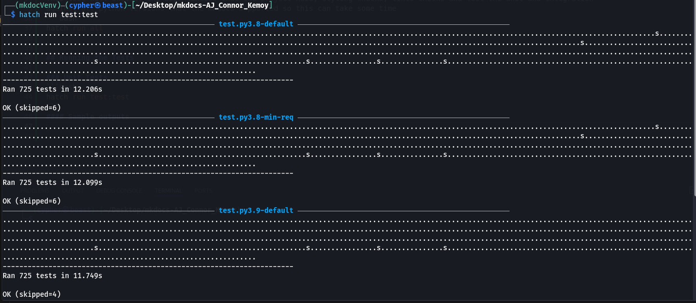
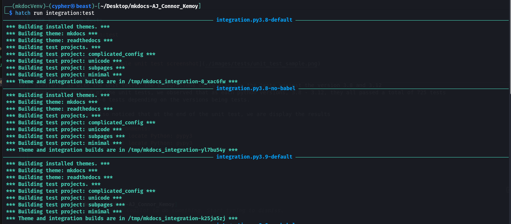
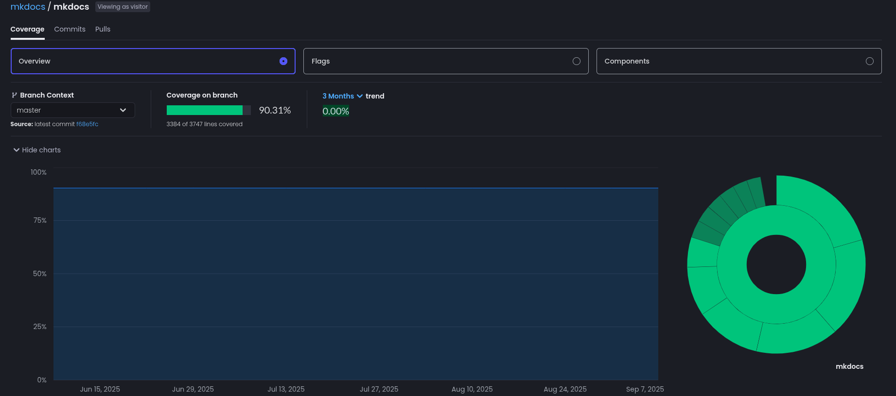
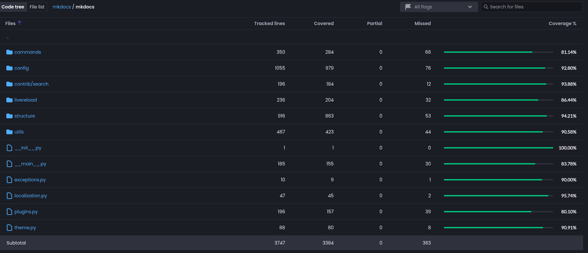

# Baseline Build & Test

## Overview

This document outlines the steps necessary to build the project as well as provides a summary of the test suite, baseline coverage metrics, and observations.

## Building the Project

1.  Clone the project:

    ```bash
    git clone https://github.com/kemoycampbell/mkdocs-AJ_Connor_Kemoy
    ```

2.  Change directory into the project folder and create a virtual environment.  
In this example, we will create a virtual environment called mkdocVenv:

    ```bash
    cd mkdocs-AJ_Connor_Kemoy && python3 -m venv mkdocVenv
    ```

3.  Activate the mkdocVenv environment.  
    **This will highly depend on your operating system:**

    - Linux & MacOS

    ```bash
      source mkdocVenv/bin/activate
    ```

    - Windows

    ```bash
      source mkdocVenv/Scripts/activate
    ```

4.  The main tool used to coordinate development and run tests in MkDocs is Hatch (<https://hatch.pypa.io/>). Install it:

    ```bash
    pip install hatch
    ```

5.  Ensure that all requirements and dependencies are installed by running the check.  
This command installs the project’s dependencies, runs style and lint checks, and executes the unit and integration tests against all supported Python versions. This may take some time:

```bash
hatch run all
```

## Running the Tests

### Unit Tests

Run the unit tests with:

```bash
hatch run test:test
```

#### Sample Output



#### Observations

During the unit test runs across Python versions 3.8–3.12, all versions passed a total of 725 tests, with some versions skipping 4–6 tests.  

Additionally, at the end of the unit tests we observed the following results:

```bash
Skipped 2 incompatible environments:
test.pypy3-default -> cannot locate Python: pypy3
test.pypy3-min-req -> cannot locate Python: pypy3
```

### Integration Tests

Run the integration tests with:

```bash
hatch run integration:test
```

#### Sample Output



#### Observations

As with the unit tests, the integration tests ran across Python versions 3.8–3.12.  
It was observed that the following checks were included in the integration tests:

- Building installed themes  
- Building theme: mkdocs  
- Building theme: readthedocs  
- Building test projects  
- Building test project: complicated_config  
- Building test project: unicode  
- Building test project: subpages  
- Building test project: minimal  

Theme and integration builds are placed in a temporary directory:
/tmp/mkdocs_integration-<8 unique characters>

Additionally, at the end of the integration tests we observed the following results:
Skipped 2 incompatible environments:

```bash
test.pypy3-default -> cannot locate Python: pypy3
test.pypy3-min-req -> cannot locate Python: pypy3
```

## Baseline coverage metrics and observations

### Code Coverage Summary

#### Version Tests

- [x] Python 3.8
- [x] Python 3.9
- [x] Python 3.10
- [x] Python 3.11
- [x] Python 3.12

#### Total Coverages

According to [CodeCov report](https://app.codecov.io/github/mkdocs/mkdocs/tree/master?displayType=list), mkdocs boost a codecoverage of 90.31%


#### Coverage Table - High Level



### Metrics breakdowns

The breakdown of the metrics was perform using custom scanner script that we build in [courseProjectCode/Metrics/](../courseProjectCode/Metrics/). The scripts obtains the metrics by scanning the codebase as well as fetch the coverage report from Codecov via the API.

#### Code Summary

- Python files scanned: **66**
- Total lines: **19617**
- Code lines: **13585**
- Comment lines: **2653**
- Blank lines: **3379**

#### Ratios

- Code: **13585** (69.3%)
- Comments: **2653** (13.5%)
- Blank: **3379** (17.2%)
- Comment density: **0.195** (19.5%)

#### Testability - Code Coverage Report

#### mkdocs

-**Total Lines:** 3747 | **Coverage:** 90.31% | **Lines test:** 3384 | **Misses:** 363

  **Files:**

```python
  - __init__.py (1 lines, 100.00%, 1 lines test, 0 misses)
  - __main__.py (185 lines, 83.78%, 155 lines test, 30 misses)
  - exceptions.py (10 lines, 90.00%, 9 lines test, 1 misses)
  - localization.py (47 lines, 95.74%, 45 lines test, 2 misses)
  - plugins.py (196 lines, 80.10%, 157 lines test, 39 misses)
  - theme.py (88 lines, 90.91%, 80 lines test, 8 misses)
```

##### commands

-**Total Lines:** 350 | **Coverage:** 81.14% | **Lines test:** 284 | **Misses:** 66

  **Files:**

```python
  - build.py (179 lines, 97.21%, 174 lines test, 5 misses)
  - gh_deploy.py (84 lines, 88.10%, 74 lines test, 10 misses)
  - new.py (26 lines, 88.46%, 23 lines test, 3 misses)
  - serve.py (61 lines, 21.31%, 13 lines test, 48 misses)
```

##### config

-**Total Lines:** 1055 | **Coverage:** 92.80% | **Lines test:** 979 | **Misses:** 76

  **Files:**

```python
  - __init__.py (2 lines, 100.00%, 2 lines test, 0 misses)
  - base.py (214 lines, 91.12%, 195 lines test, 19 misses)
  - config_options.py (726 lines, 92.42%, 671 lines test, 55 misses)
  - defaults.py (113 lines, 98.23%, 111 lines test, 2 misses)
```

##### contrib/search

-**Total Lines:** 196 | **Coverage:** 93.88% | **Lines test:** 184 | **Misses:** 12

  **Files:**

```python
  - __init__.py (87 lines, 94.25%, 82 lines test, 5 misses)
  - search_index.py (109 lines, 93.58%, 102 lines test, 7 misses)
```

##### livereload

-**Total Lines:** 236 | **Coverage:** 86.44% | **Lines test:** 204 | **Misses:** 32

  **Files:**

```python
  - __init__.py (236 lines, 86.44%, 204 lines test, 32 misses)
```

##### structure

-**Total Lines:** 916 | **Coverage:** 94.21% | **Lines test:** 863 | **Misses:** 53

  **Files:**

```python
  - __init__.py (25 lines, 92.00%, 23 lines test, 2 misses)
  - files.py (330 lines, 90.61%, 299 lines test, 31 misses)
  - nav.py (153 lines, 96.73%, 148 lines test, 5 misses)
  - pages.py (361 lines, 95.84%, 346 lines test, 15 misses)
  - toc.py (47 lines, 100.00%, 47 lines test, 0 misses)
```

##### utils

-**Total Lines:** 467 | **Coverage:** 90.58% | **Lines test:** 423 | **Misses:** 44

  **Files:**

```python
  - __init__.py (216 lines, 95.37%, 206 lines test, 10 misses)
  - babel_stub.py (22 lines, 100.00%, 22 lines test, 0 misses)
  - cache.py (11 lines, 0.00%, 0 lines test, 11 misses)
  - filters.py (1 lines, 0.00%, 0 lines test, 1 misses)
  - meta.py (38 lines, 100.00%, 38 lines test, 0 misses)
  - rendering.py (63 lines, 90.48%, 57 lines test, 6 misses)
  - templates.py (41 lines, 80.49%, 33 lines test, 8 misses)
  - yaml.py (75 lines, 89.33%, 67 lines test, 8 misses)
```

### Additional Observation
