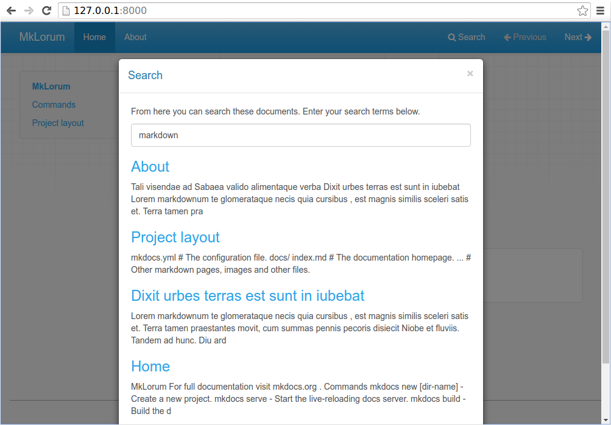
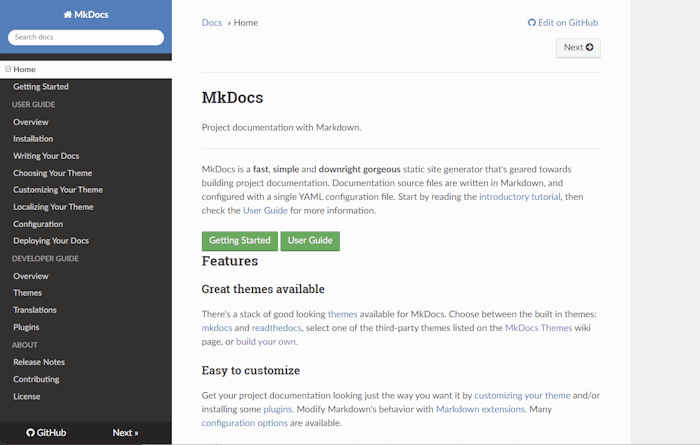

# Getting Started with MkDocs

An introductory tutorial!

---

## Installation

To install MkDocs, run the following command from the command line:

```bash
pip install mkdocs
```

For more details, see the [Installation Guide].

## Creating a new project

Getting started is super easy. To create a new project, run the following
command from the command line:

```bash
mkdocs new my-project
cd my-project
```

Take a moment to review the initial project that has been created for you.


There's a single configuration file named `mkdocs.yml`, and a folder named
`docs` that will contain your documentation source files (`docs` is
the default value for the [docs_dir] configuration setting). Right now the `docs`
folder just contains a single documentation page, named `index.md`.

MkDocs comes with a built-in dev-server that lets you preview your documentation
as you work on it. Make sure you're in the same directory as the `mkdocs.yml`
configuration file, and then start the server by running the `mkdocs serve`
command:

```console
$ mkdocs serve
INFO    -  Building documentation...
INFO    -  Cleaning site directory
INFO    -  Documentation built in 0.22 seconds
INFO    -  [15:50:43] Watching paths for changes: 'docs', 'mkdocs.yml'
INFO    -  [15:50:43] Serving on http://127.0.0.1:8000/
```

Open up <http://127.0.0.1:8000/> in your browser, and you'll see the default
home page being displayed:


The dev-server also supports auto-reloading, and will rebuild your documentation
whenever anything in the configuration file, documentation directory, or theme
directory changes.

Open the `docs/index.md` document in your text editor of choice, change the
initial heading to `MkLorum`, and save your changes. Your browser will
auto-reload and you should see your updated documentation immediately.

Now try editing the configuration file: `mkdocs.yml`. Change the
[`site_name`][site_name] setting to `MkLorum` and save the file.

```yaml
site_name: MkLorum
```

Your browser should immediately reload, and you'll see your new site name take
effect.


NOTE:
The [`site_name`][site_name] configuration
option is the only required option in your configuration file.

## Adding pages

Now add a second page to your documentation:

```bash
curl 'https://jaspervdj.be/lorem-markdownum/markdown.txt' > docs/about.md
```

As our documentation site will include some navigation headers, you may want to
edit the configuration file and add some information about the order, title, and
nesting of each page in the navigation header by adding a [`nav`][nav]
setting:

```yaml
site_name: MkLorum
nav:
  - Home: index.md
  - About: about.md
```

Save your changes and you'll now see a navigation bar with `Home` and `About`
items on the left as well as `Search`, `Previous`, and `Next` items on the
right.


Try the menu items and navigate back and forth between pages. Then click on
`Search`. A search dialog will appear, allowing you to search for any text on
any page. Notice that the search results include every occurrence of the search
term on the site and links directly to the section of the page in which the
search term appears. You get all of that with no effort or configuration on your
part!



## Theming our documentation

Now change the configuration file to alter how the documentation is displayed by
changing the theme. Edit the `mkdocs.yml` file and add a [`theme`][theme] setting:

```yaml
site_name: MkLorum
nav:
  - Home: index.md
  - About: about.md
theme: readthedocs
```

Save your changes, and you'll see the ReadTheDocs theme being used.



## Changing the Favicon Icon

By default, MkDocs uses the [MkDocs favicon] icon. To use a different icon, create
an `img` subdirectory in the `docs` directory and copy your custom `favicon.ico`
file to that directory. MkDocs will automatically detect and use that file as your
favicon icon.

[MkDocs favicon]: img/favicon.ico

## Building the site

That's looking good. You're ready to deploy the first pass of your `MkLorum`
documentation. First build the documentation:

```bash
mkdocs build
```

This will create a new directory, named `site`. Take a look inside the
directory:

```console
$ ls site
about  fonts  index.html  license  search.html
css    img    js          mkdocs   sitemap.xml
```

Notice that your source documentation has been output as two HTML files named
`index.html` and `about/index.html`. You also have various other media that's
been copied into the `site` directory as part of the documentation theme. You
even have a `sitemap.xml` file and `mkdocs/search_index.json`.

If you're using source code control such as `git` you probably don't want to
check your documentation builds into the repository. Add a line containing
`site/` to your `.gitignore` file.

```bash
echo "site/" >> .gitignore
```

If you're using another source code control tool you'll want to check its
documentation on how to ignore specific directories.

## Other Commands and Options

There are various other commands and options available. For a complete list of
commands, use the `--help` flag:

```bash
mkdocs --help
```

To view a list of options available on a given command, use the `--help` flag
with that command. For example, to get a list of all options available for the
`build` command run the following:

```bash
mkdocs build --help
```

## Deploying

The documentation site that you just built only uses static files so you'll be
able to host it from pretty much anywhere. Simply upload the contents of the
entire `site` directory to wherever you're hosting your website from and
you're done. For specific instructions on a number of common hosts, see the
[Deploying your Docs][deploy] page.

## Getting help

See the [User Guide] for more complete documentation of all of MkDocs' features.

To get help with MkDocs, please use the [GitHub discussions] or [GitHub issues].

[Installation Guide]: user-guide/installation.md
[docs_dir]: user-guide/configuration.md#docs_dir
[deploy]: user-guide/deploying-your-docs.md
[nav]: user-guide/configuration.md#nav
[GitHub discussions]: https://github.com/mkdocs/mkdocs/discussions
[GitHub issues]: https://github.com/mkdocs/mkdocs/issues
[site_name]: user-guide/configuration.md#site_name
[theme]: user-guide/configuration.md#theme
[User Guide]: user-guide/README.md
