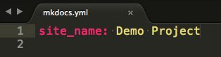

# MkDocs

Project documentation with&nbsp;Markdown.

---

## Overview

MkDocs is a **fast**, **simple** and **downright gorgeous** static site generator that's geared towards building project documentation. Documentation source files are written in Markdown, and configured with a single YAML configuration file.

---

**MkDocs is currently still in development.**

We're progressing quickly, but the documentation still needs filling in, and theres a few rough edges.  The 1.0 release is planned to arrive in the next few weeks.

---

#### Host anywhere.

Builds completely static HTML sites that you can host on GitHub pages, Amazon S3, or anywhere else you choose.

#### Great themes available.

There's a stack of good looking themes included by default. Choose from bootstrap, readthedocs, or any of the 12 bootswatch themes.

#### Preview your site as you work.

The built-in devserver allows you to preview your documentation as you're writing it. It will even auto-reload whenever you save any changes, so all you need to do to see your latest edits is refresh your browser.

#### Easy to customize.

Get your project documentation looking just the way you want it by customizing the theme.

#### Cross-reference your documentation.

Create richly cross-referenced documents, using the MkDocs interlinking syntax.

---

## Installation

In order to install MkDocs you'll need [Python][python] installed on your system, as well as the Python package manager, [pip][pip].  You can check if you have these already installed like so:

    $ python --version
    Python 2.7.2
    $ pip --version
    pip 1.5.2

MkDocs supports Python 2.6, 2.7, 3.3 and 3.4.

Install the `mkdocs` package using pip:

    $ pip install mkdocs

You should now have the `mkdocs` command installed on your system.  Run `mkdocs help` to check that everything worked okay.

    $ mkdocs help
    mkdocs [help|new|build|serve|gh-deploy] {options}

---

## Getting started

Getting started is super easy.

    $ mkdocs new my-project
    $ cd my-project

Let's take a moment to review the initial project that's been created for us.

There's a single configuration file named `mkdocs.yml`, and a folder named `docs` that will contain our documentation source files.  Right now the `docs` folder just contains a single documentation page, named `index.md`.

MkDocs comes with a built-in webserver that lets you preview your documentation as you work on it. We start the webserver by making sure we're in the same directory as the `mkdocs.yml` config file, and then running the `mkdocs serve` command:

    $ mkdocs serve
	Running at: http://127.0.0.1:8000/

Open up [http://127.0.0.1:8000/](http://127.0.0.1:8000/) in your browser, and you'll see the index page being displayed:

The webserver also supports auto-reloading, and will rebuild your documentation whenever anything in the configuration file, documentation directory or theme directory changes.

Go ahead and edit the `docs/index.md` file now and save the file. Then simply hit reload in the browser and you'll see your updated documentation.

Now's also a good time to edit the configuration file, `mkdocs.yml`.  Change the `site_name` setting to something else and save the file.

Once you hit reload in the browser you'll see your new site name take effect.

## Adding pages

Go ahead and edit the `doc/index.md` document, and change the initial heading to `MkLorum`, then reload the site in your browser, and you should see the change take effect immediately.

Let's also add a second page to our documentation:

    $ curl 'jaspervdj.be/lorem-markdownum/markdown.txt' > docs/about.md

We'd like our documentation site to include some navigation headers, so we'll edit the configuration file and add some information about the order and title to use for out headers:

    site_name: MkLorum
    pages:
    - [index.md, Home]
    - [about.md, About]

Refresh the browser and you'll now see a navigation bar with `Home` and `About` headers.

## Theming our documentation

While we're here can also change the configuration file to alter how the documentation is displayed.  Let's go ahead and change the theme.  Edit the `mkdocs.yml` file to the following:

    site_name: MkLorum
    pages:
    - [index.md, Home]
    - [about.md, About]
    theme: readthedocs

Refresh the browser again, and you'll now see the ReadTheDocs theme being used.

## Building the site

That's looking good.  We're ready to deploy the first pass of our `MkLorum` documentation now.  Let's build the documentation.

    $ mkdocs build

This will create a new directory, named `site`.  Let's take a look inside the directory:

    $ ls site
    about css fonts img index.html js

Notice that our source documentation has been output as two HTML files named `index.html` and `about/index.html`.  We also have various other media that's been copied into the `site` directory as part of the documentation theme.

If you're using source code control such as `git` you probably don't want to check your documentation builds into the repository.  Add a line containing `site/` to your `.gitignore` file.

    $ echo "site/" >> .gitignore

If you're using another source code control you'll want to check it's documentation on how to ignore specific directories.

After some time, files may be removed from the documentation but they will still reside in the `site` directory. To remove those stale files, just run mkdocs with the `--clean` switch.

    $ mkdocs build --clean

## Deploying

The documentation site that we've just built only uses static files so you'll be able to host it from pretty much anywhere. [GitHub project pages](https://help.github.com/articles/creating-project-pages-manually) and [Amazon S3](http://docs.aws.amazon.com/AmazonS3/latest/dev/WebsiteHosting.html) are good hosting options. Upload the contents of the entire `site` directory to wherever you're hosting your website from and you're done.

[python]: https://www.python.org/
[pip]: http://pip.readthedocs.org/en/latest/installing.html
