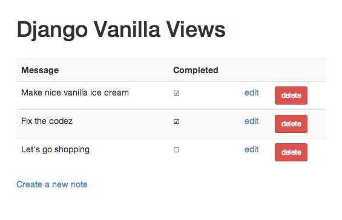

# Django Vanilla Views

**Beautifully simple class-based views.**

**Author:** Tom Christie. Follow me on Twitter, [here][twitter].

  

    View --+------------------------- RedirectView
           |
           +-- GenericView -------+-- TemplateView
           |                      |
           |                      +-- FormView
           |
           +-- GenericModelView --+-- ListView
                                  |
                                  +-- DetailView
                                  |
                                  +-- CreateView
                                  |
                                  +-- UpdateView
                                  |
                                  +-- DeleteView

Django's generic class-based view implementation is unneccesarily complicated.

Django vanilla views gives you **exactly the same functionality**, in a vastly simplified, easier-to-use package, including:

* No mixin classes.
* No calls to `super()`.
* A sane class hierarchy.
* A stripped down API.
* Simpler method implementations, with less magical behavior.

Remember, even though the API has been greatly simplified, everything you're able to do with Django's existing implementation is also supported in `django-vanilla-views`.  Although note that the package does not yet include the date based generic views.

If you believe you've found some behavior in Django's generic class-based views that can't also be trivially achieved in `django-vanilla-views`, then please [open a ticket][tickets], and we'll treat it as a bug.  To review the full set of API differences between the two implementations, please see the migration guide for the [base views][base-views-migration], and the [model views][model-views-migration].

For further background, the original release announcement for `django-vanilla-views` is [available here][release-announcement].  There are also slides to a talk ['Design by minimalism'][design-by-minimalism] which introduces `django-vanilla-views` and was presented at the Django User Group, London.  You can also view the Django class hierarchy for the same set of views that `django-vanilla-views` provides, [here][django-cbv-hierarchy].

## Helping you to code smarter

Django Vanilla Views isn't just easier to use.  I'd contest that because it presents fewer points of API to override, you'll also end up writing better, more maintainable code as a result.  You'll be working from a smaller set of repeated patterns throughout your projects, and with a much more obvious flow control in your views.

As an example, a custom view implemented against Django's `CreateView` class might typically look something like this:

    from django.views.generic import CreateView

	class AccountCreateView(CreateView):
	    model = Account

	    def get_success_url(self):
	        return self.object.account_activated_url()

		def get_form_class(self):
		    if self.request.user.is_staff:
		        return AdminAccountForm
		    return AccountForm

	    def get_form_kwargs(self):
	        kwargs = super(AccountCreateView, self).get_form_kwargs()
	        kwargs['owner'] = self.request.user
	        return kwargs
 
	    def form_valid(self, form):
	        send_activation_email(self.request.user)
	        return super(AccountCreateView, self).form_valid(form)

Writing the same code with `django-vanilla-views`, you'd instead arrive at a simpler, more concise, and more direct style:

    from vanilla import CreateView
	from django.http import HttpResponseRedirect

	class AccountCreateView(CreateView):
	    model = Account

	    def get_form(self, data=None, files=None, **kwargs):
	        user = self.request.user	        
	        if user.is_staff:
	            return AdminAccountForm(data, files, owner=user, **kwargs)
	        return AccountForm(data, files, owner=user, **kwargs)

	    def form_valid(self, form):
	        send_activation_email(self.request.user)
	        account = form.save()
	        return HttpResponseRedirect(account.account_activated_url())

## Requirements

* **Django**: 1.3, 1.4, 1.5, 1.6
* **Python**: 2.6, 2.7, 3.2, 3.3

## Installation

Install using pip.

    pip install django-vanilla-views

## Usage

Import and use the views.

    from vanilla import ListView, DetailView

For example:

	from django.core.urlresolvers import reverse_lazy
	from example.notes.models import Note
	from vanilla import CreateView, DeleteView, ListView, UpdateView
	
	class ListNotes(ListView):
	    model = Note
	
	
	class CreateNote(CreateView):
	    model = Note
	    success_url = reverse_lazy('list_notes')
	
	
	class EditNote(UpdateView):
	    model = Note
	    success_url = reverse_lazy('list_notes')
	
	
	class DeleteNote(DeleteView):
	    model = Note
	    success_url = reverse_lazy('list_notes')

## Compare and contrast

To help give you an idea of the relative complexity of `django-vanilla-views` against Django's existing implementations, let's compare the two.

#### Inheritance hierachy, Vanilla style.

The inheritance hierarchy of the views in `django-vanilla-views` is trivial, making it easy to figure out the control flow in the view.

    CreateView --> GenericModelView --> View

**Total number of source files**: 1 ([model_views.py][model_views.py])

#### Inheritance hierachy, Django style.

Here's the corresponding inheritance hiearchy in Django's implementation of `CreateView`.

                 +--> SingleObjectTemplateResponseMixin --> TemplateResponseMixin
                 |
    CreateView --+                     +--> ProcessFormView --> View
                 |                     |                                       
                 +--> BaseCreateView --+
                                       |                     +--> FormMixin ----------+
                                       +--> ModelFormMixin --+                        +--> ContextMixin
                                                             +--> SingleObjectMixin --+

**Total number of source files**: 3 ([edit.py][edit.py], [detail.py][detail.py], [base.py][base.py])

---

#### Calling hierarchy, Vanilla style.

Let's take a look at the calling hierarchy when making an HTTP `GET` request to `CreateView`.

	CreateView.get()
	|
	+--> GenericModelView.get_form()
	|    |
	|    +--> GenericModelView.get_form_class()
	|
	+--> GenericModelView.get_context_data()
	|    |
	|    +--> GenericModelView.get_context_object_name()
	|
	+--> GenericModelView.render_to_response()
	     |
	     +--> GenericModelView.get_template_names()

**Total number of code statements covered**: ~40

#### Calling hierarchy, Django style.

Here's the equivalent calling hierarchy in Django's `CreateView` implementation.

	BaseCreateView.get()
	|
	+--> ProcessFormView.get()
	     |
	     +--> ModelFormMixin.get_form_class()
	     |    |
	     |    +--> SingleObjectMixin.get_queryset()
	     |
	     +--> FormMixin.get_form()
	     |    |
	     |    +--> ModelFormMixin.get_form_kwargs()
	     |    |    |
	     |    |    +--> FormMixin.get_form_kwargs()
	     |    |
	     |    +--> FormMixin.get_prefix()
	     |    |
	     |    +--> FormMixin.get_initial()
	     |
 	     +--> ModelFormMixin.get_context_data()
	     |    |
	     |    +--> SingleObjectMixin.get_context_object_name()
	     |    |
	     |    +--> SingleObjectMixin.get_context_data()
	     |         |
	     |         +--> SingleObjectMixin.get_context_object_name()
	     |         |
	     |         +--> ContextMixin.get_context_data()
	     |
	     +--> TemplateResponseMixin.render_to_response()
	          |
	          +--> SingleObjectTemplateResponseMixin.get_template_names()
	          |
	          +--> TemplateResponseMixin.get_template_names()

**Total number of code statements covered**: ~70

## Example project

This repository includes an example project in the [example][example] directory.

You can run the example locally by following these steps:

    git clone git://github.com/tomchristie/django-vanilla-views.git
    cd django-vanilla-views/example

    # Create a clean virtualenv environment and install Django
    virtualenv env
    source env/bin/activate
    pip install -r requirements.txt

    # Ensure the local copy of the 'vanilla' pacakge is on our path
    export PYTHONPATH=..:. 

    # Run the project
    python ./manage.py syncdb --noinput
    python ./manage.py runserver

Open a browser and navigate to `http://127.0.0.1:8000`.

Once you've added a few notes you should see something like the following:

---

## License

Copyright © Tom Christie.

All rights reserved.

Redistribution and use in source and binary forms, with or without 
modification, are permitted provided that the following conditions are met:

Redistributions of source code must retain the above copyright notice, this 
list of conditions and the following disclaimer.
Redistributions in binary form must reproduce the above copyright notice, this 
list of conditions and the following disclaimer in the documentation and/or 
other materials provided with the distribution.
THIS SOFTWARE IS PROVIDED BY THE COPYRIGHT HOLDERS AND CONTRIBUTORS "AS IS" AND 
ANY EXPRESS OR IMPLIED WARRANTIES, INCLUDING, BUT NOT LIMITED TO, THE IMPLIED 
WARRANTIES OF MERCHANTABILITY AND FITNESS FOR A PARTICULAR PURPOSE ARE 
DISCLAIMED. IN NO EVENT SHALL THE COPYRIGHT HOLDER OR CONTRIBUTORS BE LIABLE 
FOR ANY DIRECT, INDIRECT, INCIDENTAL, SPECIAL, EXEMPLARY, OR CONSEQUENTIAL 
DAMAGES (INCLUDING, BUT NOT LIMITED TO, PROCUREMENT OF SUBSTITUTE GOODS OR 
SERVICES; LOSS OF USE, DATA, OR PROFITS; OR BUSINESS INTERRUPTION) HOWEVER 
CAUSED AND ON ANY THEORY OF LIABILITY, WHETHER IN CONTRACT, STRICT LIABILITY, 
OR TORT (INCLUDING NEGLIGENCE OR OTHERWISE) ARISING IN ANY WAY OUT OF THE USE 
OF THIS SOFTWARE, EVEN IF ADVISED OF THE POSSIBILITY OF SUCH DAMAGE.

[twitter]: http://twitter.com/_tomchristie
[tickets]: https://github.com/tomchristie/django-vanilla-views/issues
[base-views-migration]: migration/base-views.md
[model-views-migration]: migration/model-views.md
[release-announcement]: http://dabapps.com/blog/fixing-djangos-generic-class-based-views/
[design-by-minimalism]: http://slid.es/tomchristie/design-by-minimalism
[django-cbv-hierarchy]: img/djangocbv.png
[model_views.py]: https://github.com/tomchristie/django-vanilla-views/tree/master/vanilla/model_views.py
[base.py]: https://github.com/django/django/tree/master/django/views/generic/base.py
[detail.py]: https://github.com/django/django/tree/master/django/views/generic/detail.py
[edit.py]: https://github.com/django/django/tree/master/django/views/generic/edit.py
[example]: https://github.com/tomchristie/django-vanilla-views/tree/master/example
